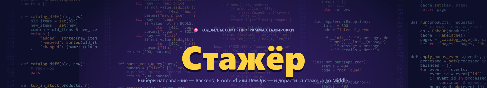
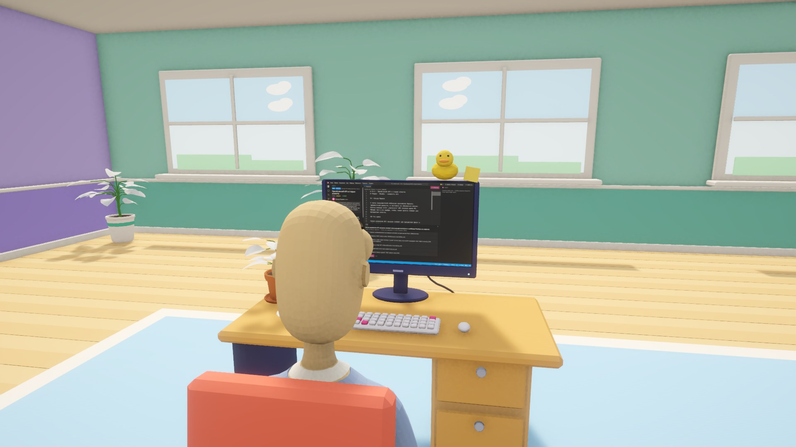
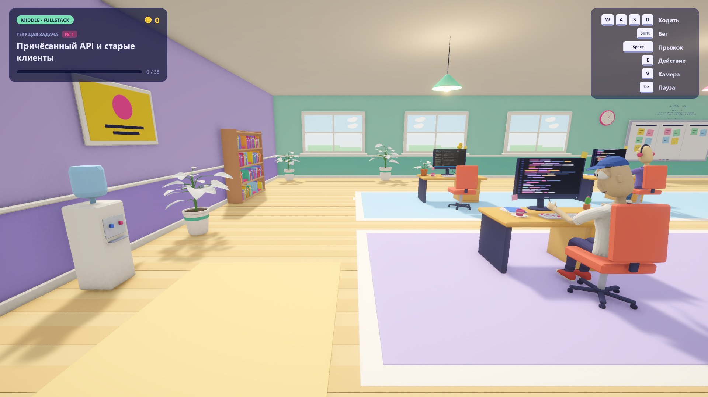
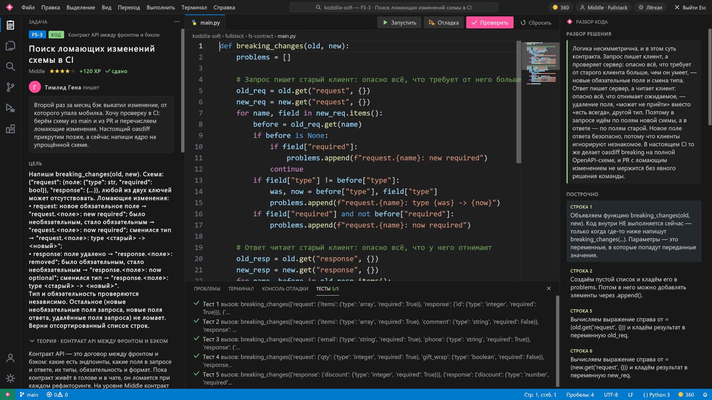
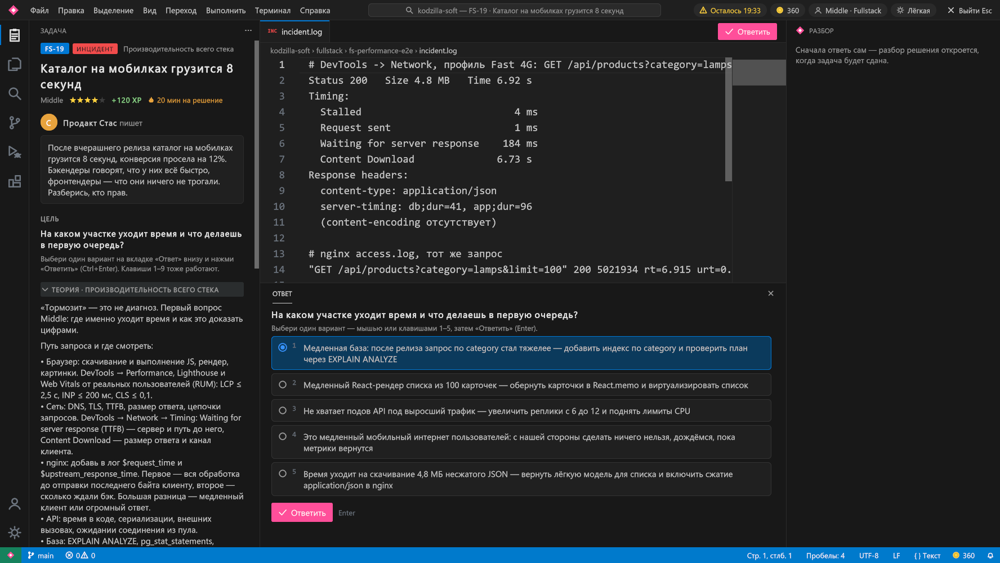
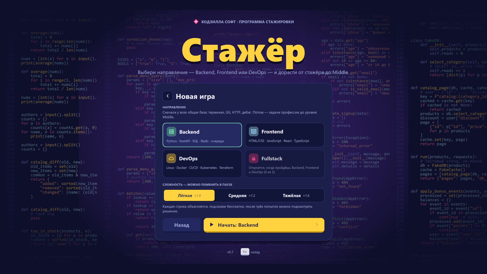

<p align="center">
  
</p>

<h1 align="center">Стажёр</h1>

<p align="center">
  <b>Симулятор стажёра в IT-компании, который по-настоящему учит программированию.</b><br>
  От первого <code>cd</code> в терминале до уровня Middle — в Backend, Frontend или DevOps.
</p>

<p align="center">
  <a href="https://github.com/GureganHokex/stazher/releases/latest"></a>
  
  
  
  <a href="LICENSE"></a>
</p>

<p align="center">
  <a href="https://github.com/GureganHokex/stazher/releases/latest"><b>Скачать для Windows</b></a> ·
  <a href="#как-играть">Как играть</a> ·
  <a href="#направления">Направления</a> ·
  <a href="#сборка-из-исходников">Сборка из исходников</a>
</p>

---

Тебя взяли на стажировку в «Кодзилла Софт». Садишься за компьютер — и прямо на мониторе открывается IDE в стиле VS Code.
Тимлид Гена присылает первые тикеты, тестировщица Ира приносит баги с шагами воспроизведения, DevOps Дима будит инцидентами на проде,
а клиенты — пекарня «Батон», фитнес-клуб «Жми» и бизнес-центр «Высота» — хотят всё и вчера.

Код, который ты пишешь, **по-настоящему выполняется и проверяется тестами**: Python, JavaScript, SQL, конфиги Docker, Kubernetes, nginx и Terraform.
Каждая ошибка заводит в офисе живого жука-бага — его придётся поймать.

<p align="center">
  
  
</p>
<p align="center">
  
  
</p>

## Что внутри

- **4 направления.** Backend, Frontend, DevOps — и Fullstack, который открывается, когда пройдены все три.
- **400 задач и 86 тем с теорией.** Теория написана как урок: понятия, правильные приёмы, частые ошибки, команды.
- **Рост по грейдам** Стажёр → Junior → Junior+ → Middle: темы открываются, когда дорос до их грейда и прошёл нужные темы.
- **7 типов задач, как на работе:** написать код, найти баг, провести код-ревью, выбрать архитектуру, разрулить инцидент, оценить задачу, ответить на вопрос.
- **Настоящая проверка кода.** Свой интерпретатор Python, JavaScript на движке Jint, SQL в SQLite, требования к YAML, Dockerfile, bash, nginx, Terraform и PromQL.
- **IDE в стиле VS Code на мониторе в офисе:** подсветка 14 языков, автодополнение, терминал, тесты, пошаговый отладчик Python с точками остановки и разбором каждой строки.
- **Живой офис:** коллеги, кофемашина с бустами, гардероб с костюмами для разных профессий, жуки-баги.
- **3 сложности:** от «каждая строка объясняется и можно подсмотреть решение» до дедлайнов без теории и подсказок.

## Направления

| Направление | Тем | Задач | Чему учит |
|---|:-:|:-:|---|
| **Общая база** | 10 | 45 | терминал, Git (ветки, конфликты, rebase), HTTP, сети, дебаг, документация, оценка задач, код-ревью |
| **Backend** | 26 | 121 | Python от основ до ООП и исключений, pytest, REST, FastAPI, SQL и JOIN, ORM, валидация, JWT, Docker, индексы, транзакции, N+1, Redis, очереди, async, безопасность, логи и метрики |
| **Frontend** | 21 | 99 | HTML, CSS, Flexbox и Grid, JavaScript, замыкания, промисы, DOM, React, TypeScript, Vite, состояние, производительность, event loop, CORS, SSR, тесты, доступность, XSS |
| **DevOps** | 21 | 100 | Linux, права, systemd, сети, bash, Dockerfile, compose, CI/CD, nginx, облако, Kubernetes, Helm, Terraform, Ansible, Prometheus и Grafana, логи, стратегии деплоя, секреты, бэкапы, инциденты |
| **Fullstack** | 8 | 35 | контракт API, авторизация через весь стек, фича от тикета до прода, WebSocket и SSE, производительность, релиз без простоя, системный дизайн |

<p align="center"></p>

Путь каждого направления начинается с общей базы. Её задачи засчитываются во всех направлениях, поэтому второе и третье проходятся быстрее.

## Как играть

1. Скачай `Stazher-0.7.0-win64.zip` со [страницы релиза](https://github.com/GureganHokex/stazher/releases/latest).
2. Распакуй архив в любую папку и запусти `Stazher.exe`.
3. Windows может показать «Система Windows защитила ваш компьютер» — игра не подписана сертификатом. Нажми «Подробнее» → «Выполнить в любом случае».

Нужна 64-битная Windows 10 или 11 и видеокарта с DirectX 11. Прогресс сохраняется автоматически.

### Управление

| В офисе | | За компьютером | |
|---|---|---|---|
| `W A S D` | ходить | `Ctrl+Enter` | проверить решение / ответить |
| `Shift` | бег | `Ctrl+F5` | запустить код |
| `Space` | прыжок | `F5` | отладка (Python) |
| `E` | действие: сесть за компьютер, поговорить | `F9` | точка остановки |
| `ЛКМ` | поймать жука-бага | `F10` / `F11` | шаг / шаг с заходом |
| `V` | вид от первого или третьего лица | `1`–`9`, `Enter` | выбрать вариант ответа |
| `Esc` | пауза: настройки, гардероб, смена направления | `Ctrl+B` | спрятать панель разбора |
| `F12` | скриншот | `Esc` | встать из-за компьютера |

## Сборка из исходников

- Unity **6000.6.2f1** (Unity 6.6) с модулем Windows Build Support, URP и Input System.
- Открой проект в Unity Hub и сцену `Assets/Scenes/SampleScene.unity`, нажми Play — игра собирается в любой сцене сама.
- Релизная сборка: меню **Стажёр → Собрать релиз для Windows**. Результат — в папке `Builds/`.
- Самопроверка сборки: `Stazher.exe -selftest` прогоняет эталонные решения всех 400 задач через проверки игры
  и пишет отчёт в `%USERPROFILE%\AppData\LocalLow\Codezilla Games\Стажёр\selftest.txt`.

```
Assets/Intern 3/Assets/Intern/
  Scripts/Game/      игра: офис, IDE, меню, направления, проверка задач
  Scripts/PyCore/    интерпретатор Python: парсер, исполнение, отладчик, понятные ошибки на русском
  Plugins/Jint/      движок JavaScript для проверки JS-задач
  Resources/Tasks/tracks/   контент направлений (JSON)
  Editor/            сборка релиза
Tools/Content/       исходники контента, формат задач и валидатор
```

## Контент

Все задачи лежат в `Resources/Tasks/tracks/*.json` в простом формате: темы с теорией, грейдами и зависимостями, задачи с тестами.
Их можно править руками — игра подхватит изменения. Формат описан в [`Tools/Content/spec/FORMAT.md`](Tools/Content/spec/FORMAT.md),
а валидатор проверяет, что эталонные решения проходят тесты, а заготовки — нет ([подробнее](Tools/Content/README.md)).

## Лицензия

Код — под лицензией [MIT](LICENSE). Используемые библиотеки и их лицензии — в [THIRD_PARTY_NOTICES.md](THIRD_PARTY_NOTICES.md).

<p align="center"><sub>Сделано в Codezilla Games · 2026</sub></p>
